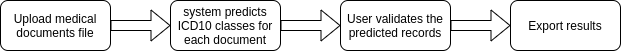

# MediCAT

<!-- START doctoc generated TOC please keep comment here to allow auto update -->
<!-- DON'T EDIT THIS SECTION, INSTEAD RE-RUN doctoc TO UPDATE -->
**Table of Contents**

- [Introduction](#introduction)

<!-- END doctoc generated TOC please keep comment here to allow auto update -->

## Introduction
MediCAT is a web application built to help the medical staff classify medical documents into ICD10 categories 
efficiently. MediCAT allows the users to upload their medical documents and start classification jobs. Then, efficient 
classification of documents is achieved through 3 steps:
* Classifying documents using a Biomed roberta BERT encoder and a Support Vector Machine Classifier
* Performing Named Entity Recognition to extract medical terms
* Display the classification NER results for each medical record in the validation dashboards and allow users to 
  validate results
  
The classification job looks like so:

## Demo
This video demonstrates how to use the web application:

