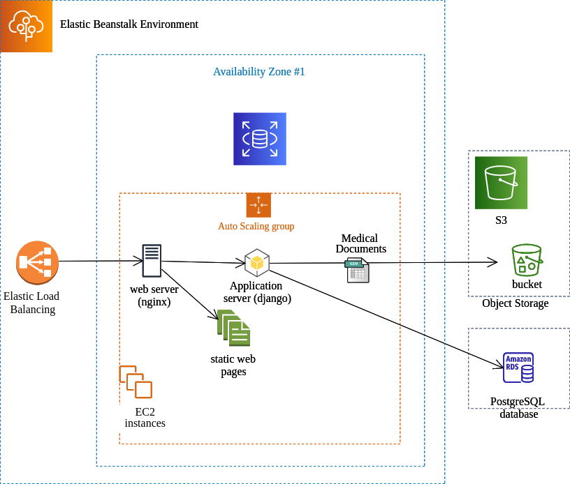

# MediCAT

<!-- START doctoc generated TOC please keep comment here to allow auto update -->
<!-- DON'T EDIT THIS SECTION, INSTEAD RE-RUN doctoc TO UPDATE -->
**Table of Contents**

- [Introduction](#introduction)
- [Demo](#demo)
- [ICD10 Classification](#icd10-classification)
- [Medical Terms Named Entity Recognition](#medical-terms-named-entity-recognition)
- [Validation Dashboard](#validation-dashboard)
- [Deployment and Infrastructure](#deployment-and-infrastructure)
  - [CI/CD pipeline](#cicd-pipeline)
  - [Infrastructure:](#infrastructure)

<!-- END doctoc generated TOC please keep comment here to allow auto update -->

## Introduction
MediCAT is a web application built to help the medical staff classify medical documents into ICD10 categories 
efficiently. MediCAT allows the users to upload their medical documents and start classification jobs. Then, efficient 
classification of documents is achieved through 3 steps:
* Classifying documents using a Biomed roberta BERT encoder and a Support Vector Machine Classifier
* Performing Named Entity Recognition to extract medical terms
* Display the classification NER results for each medical record in the validation dashboards and allow users to 
  validate results
  
The classification job looks like so:

## Demo
This video demonstrates how to use the web application:

## ICD10 Classification
We built a classification model that relies on embeddings generated by Biomed RobertaBert encoder.
Embeddings are generated for all the text fields of each medical record.
Later, the embedding vector is reduced using the PCA algorithm into a reduced vecotor of 128 values.
Finally, the reduced feature vector is fed into an Support Vector Machine Classifier which returns probabilities for 
224 classes.
The following diagram illustration the ICD10 classification process:

## Medical Terms Named Entity Recognition
To perform NER we use spacy v3.0.
Since we want to identify medical related entities we want to build upon a good baseline.
Spacy v3 already provides us with the option to use already trained weights therefore we choose
"en_core_sci_scibert" english scientific BERT. We then fine-tune it to the data we have.
We create a configuration file containing Epoch number, Learning rate, pretrained vectors path,
optimizer and different other parameters.

We then train the model for several epochs we aim to reduce TOK2VEC loss and NER loss and
we calculate ents_p, ents_r, ents_f : the precision, recall and fscore for the NER task.

The result is entities, their type and position in text we use that to highlight them in the text
like the following :

## Validation Dashboard
The validation dashboard allows users to browse records, view their ICD10 predictions with prediction scores, view the 
extracted medical terms and choose ICD10 classes among the predicted classes.

Once the user finishes validating the records, he can download all medical records with the validated IC10 classes.

## Deployment and Infrastructure
### CI/CD pipeline
A CI/CD pipeline is provisioned in order to ensure a rapid development and release cycle while
maintaining a good code quality and user experience. As explained in figure 25, developers commit
or request merge requests which triggers the CI/CD pipeline in Github Actions. Within the Github
Actions environment, AWS credentials are configured (using Github Secrets), the server-side and
client-side applications are built and tests are executed. If successful, Github Actions proceeds to
the next steps. The application source code is packaged and uploaded to S3 and then deployment
is executed within the Elastic Beanstalk environment. Elastic Beanstalk ensures that the newly
updated instances are healthy before routing traffic to them. The deployment strategy used is
rolling updates with additional batch. This means that AWS Elastic Beanstalk deploys the new
application on each instance one after the other but first creates a new batch. This insures that
there’s no downtime during deployment even if deployment fails and preserves the application’s
capacity. AWS Elastic Beanstalk keeps executing health checks on each instance. Instances that
fail health checks are recognized as unhealthy instances, are de-registered from the target group and
replaced with new ones.

The CI/CD pipeline of the project can be illustrated like so:

### Infrastructure:
The system relies on a 3-tier architecture. It’s based on the AWS Elastic Beanstalk environment.
User HTTP requests hit an application load balancer which spans different EC2 instances. The
requests are routed to an EC2 instance where they hit a web server (nginx). Nginx routes the
requests to the application server or returns static web pages based on the HTTP path. The
application server executes business logic like creating classification projects, predicting ICD10
classes, exporting results and managing user data. Medical documents and the exported results are
stored in an S3 bucket. User data and project information are stored in a relational database.

